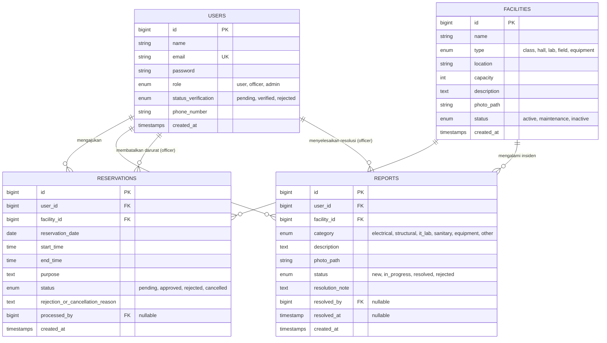

# Architecture Blueprint: Sistem Reservasi & Pelaporan Fasilitas Kampus

* **Dokumen:** Cetak Biru Arsitektur Teknis & Perancangan Basis Data
* **Proyek:** PPK 2026 – Web Platform Sebelum UTS
* **Stack:** Laravel 11.x, Laragon (PHP 8.2+, MySQL 8.0, Apache/Nginx), Tailwind/Bootstrap

---

## 1. Pemetaan Struktur MVC Laravel

Untuk memenuhi ketentuan pemisahan direktori yang diwajibkan oleh dosen (`/public`, `/app`, `/views`, `/config`), struktur proyek Laravel dipetakan sebagai berikut:

```text
reservasi-kampus/
├── public/                     <- Document Root Webserver (Apache/Nginx Laragon)
│   ├── index.php               <- Front controller entry point
│   ├── storage/                <- Symlink ke storage/app/public (foto fasilitas & bukti)
│   └── assets/                 <- CSS, JavaScript terkompilasi
│
├── app/                        <- Logika Aplikasi & Model
│   ├── Http/
│   │   ├── Controllers/        <- Pengatur alur request & response
│   │   │   ├── AuthController.php
│   │   │   ├── FacilityController.php
│   │   │   ├── ReservationController.php
│   │   │   ├── ReportController.php
│   │   │   ├── OfficerDashboardController.php
│   │   │   └── AdminDashboardController.php
│   │   ├── Middleware/         <- Filter otentikasi & hak akses (RBAC)
│   │   │   ├── EnsureUserIsVerified.php
│   │   │   └── RoleMiddleware.php (user, officer, admin)
│   │   └── Requests/           <- Validasi Sisi Server (FormRequest)
│   │       ├── StoreReservationRequest.php
│   │       ├── StoreReportRequest.php
│   │       └── RegisterRequest.php
│   └── Models/                 <- Representasi Entitas Data (Eloquent ORM)
│       ├── User.php
│       ├── Facility.php
│       ├── Reservation.php
│       └── Report.php
│
├── resources/
│   └── views/                  <- Tampilan Antarmuka (HTML + Blade Engine)
│       ├── layouts/            <- Master layout (navbar, sidebar, alert flash)
│       ├── visitor/            <- Katalog publik & jadwal ketersediaan
│       ├── user/               <- Form booking, riwayat, form pelaporan
│       ├── officer/            <- Antrean reservasi, resolusi kerusakan
│       └── admin/              <- CRUD fasilitas, verifikasi, rekap ekspor
│
├── config/                     <- Konfigurasi Sistem (Database, Auth, App)
│   ├── app.php
│   ├── auth.php
│   └── database.php
│
└── database/
    ├── migrations/             <- Skema DDL Database
    └── seeders/                <- Data master demo akun & fasilitas awal
```

---

## 2. Perancangan Basis Data (Entity Relationship Diagram)

Sistem mengelola 4 tabel relasional utama sesuai pedoman:



---

## 3. Logika Inti & Algoritma Sistem

### A. Algoritma Deteksi Bentrok Jadwal (Anti-Collision Query)
Validasi bentrok wajib dijalankan di server pada dua titik:
1. Saat Pengguna melakukan submit form reservasi (`StoreReservationRequest`).
2. Saat Petugas menekan tombol 'Setujui' (`approve`).

Query SQL deterministik untuk mendeteksi tumpang tindih waktu pada fasilitas yang sama:

```sql
SELECT COUNT(*) 
FROM reservations
WHERE facility_id = :facility_id
  AND reservation_date = :reservation_date
  AND status = 'approved'
  AND (
      (:new_start_time < end_time) AND (:new_end_time > start_time)
  )
  AND id != :current_reservation_id;
```

> **Aturan Bentrok:** Jika hasil `COUNT(*) > 0`, maka pengajuan atau persetujuan **wajib digagalkan** dengan pesan peringatan: *"Jadwal bertabrakan dengan reservasi lain yang sudah disetujui."*

### B. Validasi Granularitas Slot Waktu (30 Menit & Jam Operasional)
Diimplementasikan pada `StoreReservationRequest.php`:
* Jam mulai minimal: `07:00`
* Jam selesai maksimal: `20:00`
* `end_time` wajib lebih besar dari `start_time`.
* Menit pada `start_time` dan `end_time` wajib `00` atau `30`:
  ```php
  $minute = Carbon::parse($value)->minute;
  if (!in_array($minute, [0, 30])) {
      $fail("Slot waktu harus merupakan kelipatan 30 menit (:00 atau :30).");
  }
  ```

### C. Pembatalan Mandiri Berbatas Waktu (Cancellation Deadline)
* Pengguna hanya boleh membatalkan jika selisih waktu sekarang dengan jadwal `reservation_date + start_time` lebih besar dari toleransi waktu:
  $$	ext{Waktu Reservasi} - 	ext{Waktu Sekarang} \ge 2	ext{ Jam}$$

---

## 4. Matriks Akses Rute & Middleware (RBAC)

| Rute Endpoint | Method | Aktor yang Berhak | Keterangan Fitur |
| :--- | :---: | :--- | :--- |
| `/` & `/facilities` | GET | Publik / Pengunjung | Katalog fasilitas publik |
| `/facilities/{id}/availability` | GET | Publik / Pengunjung | Matriks slot ketersediaan tanpa identitas |
| `/register` & `/login` | GET/POST | Tamu (Guest) | Registrasi mandiri & autentikasi |
| `/reservations/create` | GET/POST | Pengguna (`user`) | Form pengajuan booking & validasi bentrok |
| `/my-reservations` | GET | Pengguna (`user`) | Riwayat peminjaman & tombol batal mandiri |
| `/reports/create` | GET/POST | Pengguna (`user`) | Form pelaporan kerusakan + upload foto |
| `/my-reports` | GET | Pengguna (`user`) | Pelacakan status tiket kerusakan |
| `/officer/reservations` | GET/POST | Petugas (`officer`) | Antrean review, setujui/tolak, batal darurat |
| `/officer/reports` | GET/POST | Petugas (`officer`) | Triage laporan & ubah status fasilitas |
| `/admin/users/verify` | GET/POST | Admin (`admin`) | Verifikasi akun registrasi mandiri |
| `/admin/facilities` | CRUD | Admin (`admin`) | Kelola master fasilitas kampus |
| `/admin/reports/export` | GET | Admin (`admin`) | Ekspor rekapitulasi PDF / CSV okupansi & insiden |
